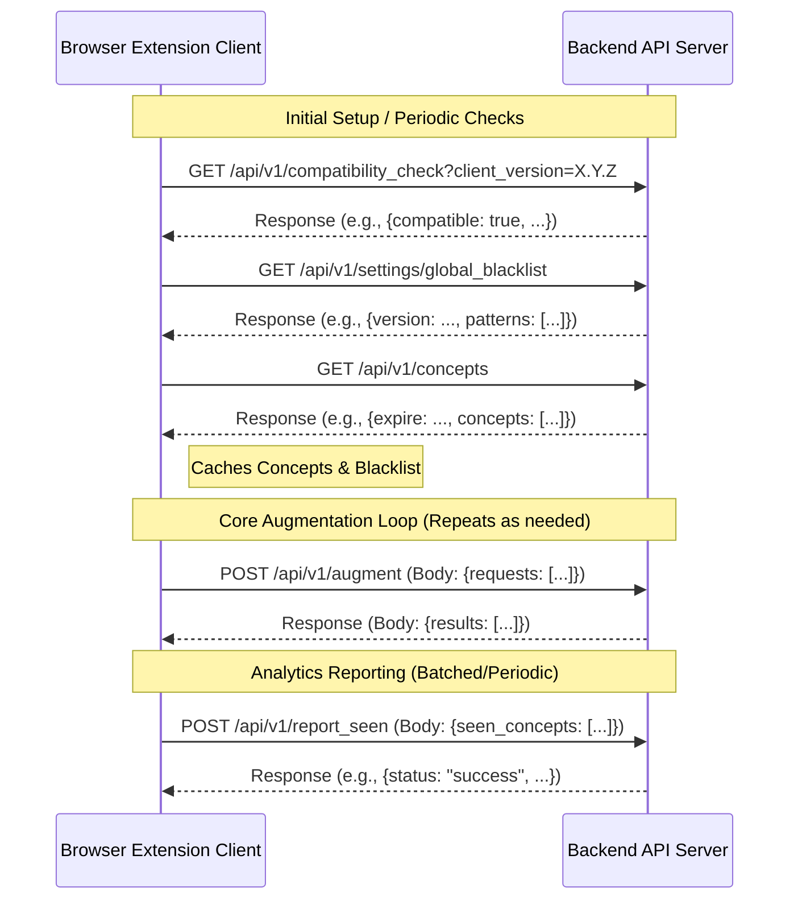
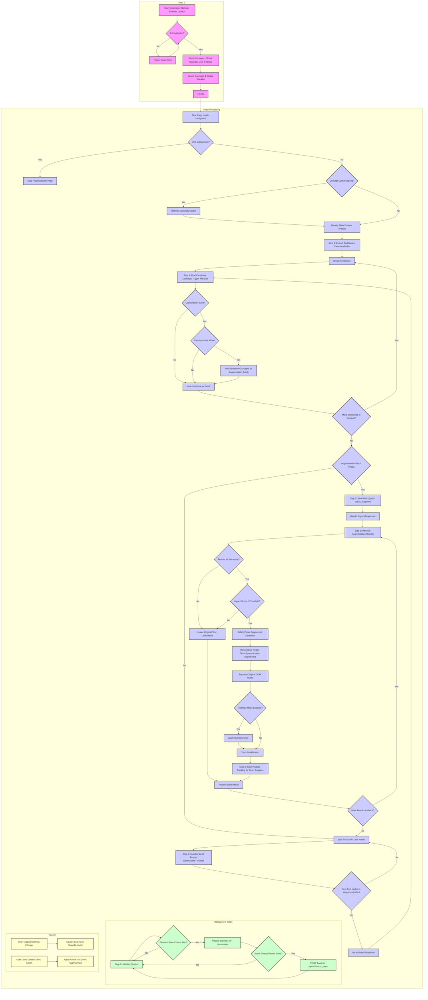
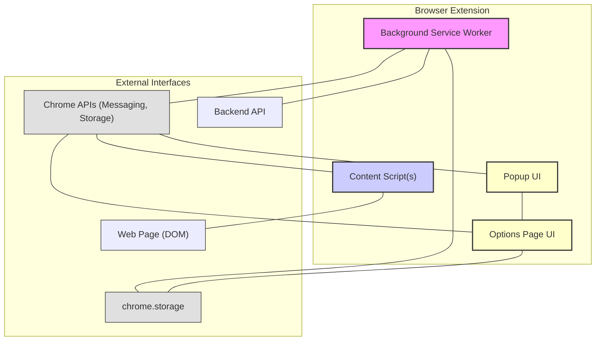
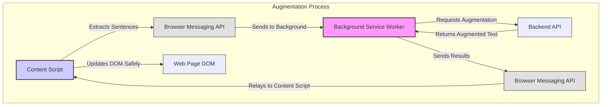
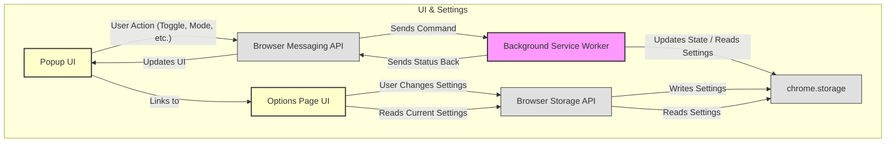

# Glite Browser Extension Specification

**Table of Contents**

- [1. Purpose](#1-purpose)
- [2. Background](#2-background)
- [3. User Stories](#3-user-stories)
- [4. Important Principles](#4-important-principles)
- [5. Features](#5-features)
- [6. User Interface](#6-user-interface)
  - [6.1 Browser Toolbar Icon & Popup](#61-browser-toolbar-icon--popup)
  - [6.2 Page Context Menu Actions](#62-page-context-menu-actions)
  - [6.3 Highlight Mode Display & Tooltip](#63-highlight-mode-display--tooltip)
  - [6.4 Settings Page](#64-settings-page)
- [7. Backend API](#7-backend-api)
  - [7.1 Authentication](#71-authentication)
  - [7.2 Getting User Learning Concepts](#72-getting-user-learning-concepts)
  - [7.3 LLM Call to Augment Text (Backend Proxy)](#73-llm-call-to-augment-text-backend-proxy)
  - [7.4 Analytics Reporting](#74-analytics-reporting)
  - [7.5 Settings](#75-settings)
  - [7.6 Compatibility Check](#76-compatibility-check)
  - [7.7 API Diagram](#77-api-diagram)
- [8. Versioning and Update Strategy](#8-versioning-and-update-strategy)
- [9. Core Functionality Workflow](#9-core-functionality-workflow)
- [10. Extension Architecture Overview](#10-extension-architecture-overview)
  - [10.1 Component Diagram](#101-component-diagram)
  - [10.2 Data Flow Diagram](#102-data-flow-diagram)
- [11. Required Permissions (Manifest V3)](#11-required-permissions-manifest-v3)
- [12. Development Tooling & Technologies](#12-development-tooling--technologies)
- [13. Browser Compatibility and Standards Compliance](#13-browser-compatibility-and-standards-compliance)
- [14. Testing Strategy & Unit Coverage](#14-testing-strategy--unit-coverage)
  - [14.1 Performance Testing](#141-performance-testing)
- [15. Scope and Out of Scope](#15-scope-and-out-of-scope)
  - [15.1 In Scope](#151-in-scope)
  - [15.2 Out of Scope](#152-out-of-scope)
- [16. Milestones](#16-milestones)

## 1. Purpose

Inject learner‑specific vocabulary, idioms, and other language
concepts into long‑form web texts, thereby "flooding" the
learner's reading environment with high‑value material chosen by
the app's adaptive scheduler.


## 2.Background

Glite Tech has developed an advanced English learning app designed
for non-beginners (Level B1+). The app focuses on identifying and
rectifying gaps in learners' knowledge by breaking the English
language down into granular "concepts." These concepts include
vocabulary items (individual word meanings, phrasal verbs, idioms,
multi-word expressions), pronunciation nuances, spelling rules,
grammatical structures, conversational norms, and standard
phrases.

The core app utilizes a sophisticated adaptive learning algorithm,
similar to spaced repetition but more advanced, to determine which
concepts a user should focus on based on their learning history.
Currently, the app allows users to actively study these concepts,
particularly vocabulary.

To enhance the learning process and provide contextual
reinforcement, we aim to develop a browser extension. This
extension will subtly modify the text content users encounter
while browsing the web, "flooding" their reading experience with
the specific concepts (words, idioms, phrasal verbs, etc.) that
our backend identifies as beneficial for their current learning
stage. This creates an immersive, passive learning environment
that complements the active study within the main application.


## 3. User Stories

1.  As a learner, I install the extension, sign in once, and
    articles I read online are seamlessly sprinkled with
    words/phrases I need to practice. The changes integrate
    naturally without breaking page layouts or causing
    noticeable lag.
2.  As a user, I can easily control the extension's behavior: I
    can toggle it on/off per website, temporarily pause
    augmentation on the current page, or switch between
    invisible text replacement and a "highlight-only" mode
    where changes are visually marked.
3.  As a learner, I want the extension to focus its efforts on
    text I'm likely to read, processing content primarily within
    my viewport and adapting as I scroll, to ensure efficient use
    of resources.
4.  As a privacy-conscious user, I am assured that the specific
    websites I visit and the full text I read are not sent to
    any external server; only isolated sentences needing
    augmentation are processed via the backend proxy.


## 4. Important Principles

* **Do No Harm:** Prioritize website stability and user
    experience. If any operation (text extraction, DOM
    manipulation, performance impact) raises doubts, err on the
    side of caution and skip the modification for that element or
    page section. Prevent crashes, layout breaks, or significant
    slowdowns.
* **Smooth User Experience & Performance:** Ensure the extension
    feels lightweight and responsive.
    * Minimize main thread blocking: Use asynchronous operations
        for all I/O (API calls). **Utilize Web Workers for
        CPU-intensive tasks** like text tokenization or complex
        analysis.
    * **Efficient Resource Management:** Actively manage memory and
        CPU. **Terminate or pause Web Workers and revoke unused
        Object URLs when tabs are hidden or discarded.**
    * Leverage browser efficiencies: Ensure network requests
        utilize **HTTP Keep-Alive (persistent connections)** where
        appropriate by coordinating with backend configuration.
    * Target minimal impact on page load times and interactivity.
* **Modular & Extensible Architecture:** Design with distinct,
    replaceable modules, preferably using **native ES Modules**.
    Implement communication between modules loosely, potentially via
    a shared **event bus or clearly defined interfaces**, to
    facilitate future extension (e.g., adding word lookup). Define
    clear interfaces for services like:
    * `LLM_Augmentation_Service(sentences_batch)`
    * `Highlighting_Service(element, mode)`
    * `Text_Extraction_Service(root_element)`
    * `Candidate_Generation_Service(sentence, concepts)`
    * `Modification_Tracking_Service(element, action)`
    * `Visibility_Tracking_Service(element, callback)`
* **Preserve Website Functionality:** Ensure that DOM
    manipulations do not break existing JavaScript event listeners
    attached to elements or their parents.
* **Minimal DOM Manipulation:** Target only text nodes for
    replacement. Avoid altering surrounding element structure,
    attributes (except for tracking/highlighting markers), or
    styles where possible.
* **Leverage Existing Libraries:** Where stable, well-maintained
    third-party libraries exist that robustly solve a specific
    problem required by the extension (e.g., DOM traversal,
    debouncing/throttling), prefer using them over reimplementing,
    provided they align with performance goals.
* **Privacy by Design:** Ensure the architecture inherently
    protects user privacy by minimizing data sent externally (no
    URLs, only isolated sentences for augmentation).
* **Centralised Decision Logic:** Implement a single "apply-or-skip" 
    decision function that all potential augmentations must pass 
    through. This function consolidates checks for markup safety 
    (Security in Workflow Step 6), user impact threshold (Workflow Step 6),
    per-sentence/paragraph caps, and rolling density limits 
    (Features & Workflow Step 4). This ensures consistent 
    application of rules and simplifies auditing and future 
    policy updates.


## 5. Features

* **Targeted Text Selection:** Modifies only text nodes within
    likely content blocks (e.g., `<p>`, `<div>`, `<article>`),
    applying a configurable minimum word count (e.g., N=30 words)
    to define "long texts". Automatically skips common non-content
    areas (navbars, sidebars, footers, headers, interactive
    elements). You can use the existing third-party libraries
    like Readability.js or develop a custom logic.
* **Ingore User-Editable Texts:** Explicitly ignores any text 
    content within user-editable regions, including `<input>` 
    fields (text, email, etc.), `<textarea>` elements, and any 
    element with the `contenteditable="true"` attribute or 
    commonly used rich-text editor classes.
* **Configurable Augmentation Density:** Limits the number of
    modifications applied within a single paragraph and per a
    configurable word count (e.g., max 1 change per paragraph, max
    5 changes per 1000 words). Parameters should be adjustable,
    potentially via settings or backend configuration.
* **Configurable Augmentation Aggressiveness:** Allows users to
    set a threshold (0-5) based on an "impact score" provided by
    the LLM API (0 = no change in meaning or tone, 
    5 = highest change; see impact score table). 
    The extension will only apply augmentations where
    the LLM indicates the change minimally affects meaning and tone
    below the user's chosen score.
* **Viewport-Aware Processing:** Optimizes performance and API
    usage by primarily processing text within the initially
    visible browser viewport plus a buffer (e.g., one screen
    height below). Additional text processing is triggered
    progressively as the user scrolls down the page.
* **Dynamic Content Handling:** Employs techniques like
    `MutationObserver` to detect and process relevant text content
    added to the page after the initial load, applying the same
    filtering and processing logic, respecting the "Do No Harm"
    principle.
* **Re-render Guard:** Keep a counter on each processed DOM node. 
    Refuse to re-process a node if it has been augmented more 
    than a configurable maximum number of times (e.g., twice) 
    to prevent infinite loops on rapidly re-rendering frameworks.
* **Efficient Concept Caching:** Fetches the user's prioritized
    learning concepts list once upon initialization and caches it
    locally for the day (or other suitable duration) to minimize
    redundant API calls.
* **"Seen" Concept Analytics:** Tracks which augmented concepts
    become visible in the viewport for a minimum duration (e.g., 2
    seconds), indicating the user likely saw them. This uses the
    `Visibility_Tracking_Service`. Reports batches of "seen"
    `concept_id`s (potentially with timestamps) to a dedicated
    backend analytics endpoint. Logic explicitly avoids reporting
    if scrolling is too fast.
* **Website Blacklisting:**
    * Fetches a global blacklist of domains/URLs from the
        backend where the extension should never run.
    * Allows users to maintain a personal blacklist (stored
        locally via `chrome.storage` or similar) to disable the
        extension on specific sites. **User-defined patterns should
        also ideally be validated against
        [Match Pattern syntax](https://help.opera.com/en/extensions/match-patterns/).**
    * Provides UI options to easily blacklist the current site.
* **Dark Mode Support:** All user interface elements (toolbar popup, 
    settings page) MUST offer a dark mode theme that respects user system 
    preferences where possible and provides sufficient contrast according 
    to WCAG 2.1 AA standards.


## 6. User Interface

This section details the user-facing controls and visual 
elements of the extension. While elaborate design is out of scope 
for V1, the following functional components are required:

### 6.1 Browser Toolbar Icon & Popup

* The extension MUST display an icon in the browser toolbar.
* The icon's appearance SHOULD indicate the extension's status (e.g., active, inactive).
* Clicking the icon opens a popup menu containing the following controls:
    * A master switch to toggle the extension globally (On/Off).
    * A toggle to enable or disable augmentation specifically for the 
      currently viewed website domain (persists across visits).
    * A selector (e.g., radio buttons or dropdown) to switch 
      between "Invisible Mode" (text replacement) and "Highlight Mode".
    * A button to immediately add the current website domain to the user's personal blacklist.
    * A link/button to navigate to the extension's full Settings page.
    * (Optional) A display showing a list or count of the specific 
      concepts that have been applied on the current page.

### 6.2 Page Context Menu Actions

* The extension MUST add options to the browser's right-click 
  context menu when clicked on the main page content area.
* Available context menu actions MUST include:
    * "Pause Augmentation on this Page": Temporarily disable augmentation
      for the current tab until it is reloaded or navigated away from.
    * "Add [domain] to Blacklist": Adds the current website's 
      domain to the user's personal blacklist.
    * "Revert and Pause Augmentation on this Page": Immediately undoes all 
      text modifications made by the extension on the current page, restoring 
      the original text fragments (requires original text to be stored, 
      e.g., in `data-original-text` attributes during modification), and 
      also prevents further augmentation attempts on the page until it is 
      reloaded or navigated away from.

### 6.3Highlight Mode Display & Tooltip

* When "Highlight Mode" is active, augmented words or phrases MUST be 
  visually distinguished (e.g., using a background color or distinct 
  styling applied via a CSS class like `augmented-highlight`).
* In Highlight Mode, hovering the mouse cursor over an augmented 
  segment MUST display a standard browser tooltip.
* The tooltip MUST contain the original text that was replaced and 
  MAY also include the short meaning of the concept that was inserted
  (retrieved from concept data and the stored `data-original-text` attribute).

### 6.4 Settings Page

* The extension MUST provide a dedicated settings page accessible via 
  the browser's extensions management area and linked from the toolbar popup.
* This page MUST allow users to:
    * View and manage their personal website blacklist (add/remove entries).
    * Select the default display mode (Invisible/Highlight).
    * Adjust the augmentation "Aggressiveness" level (corresponding to the `impact_score` threshold).
    * (Potentially other configuration options as needed).

## 7. Backend API

The extension interacts with several backend API endpoints provided by 
Glite Tech. All communication MUST use HTTPS and appropriate 
authentication (e.g., Bearer token obtained via the main app's login 
flow). Furthermore, **all API requests originating from the extension 
MUST include the `X-Client-Version` HTTP header**, indicating the 
extension's current version (e.g., `X-Client-Version: 1.2.3`).

**General Compatibility Handling:** As detailed in the "Versioning and 
Update Strategy" section, API endpoints (particularly those affected by 
breaking changes) SHOULD validate the client version on requests. If an 
incompatible client is detected, the endpoint MUST return an 
`HTTP 426 Upgrade Required` status code, potentially with a response 
body indicating the need to update.

The specific endpoints include:


### 7.1 Authentication

* **Mechanism:** [To be supplied]


### 7.2 Getting User Learning Concepts

* **Endpoint:** `GET /api/v1/concepts`
* **Description:** Fetches the prioritized list of concepts for
    the authenticated user. Designed to be called infrequently
    (e.g., once per day) and cached client-side.
* **Response:** JSON with expiration date time and the array of concept objects.
    ```json
    {
    "expire": "2025-04-20T22:19:00Z",
    "concepts": [
      {
        "concept_id": "word_encompass_include",
        "type": "word",
        "text": "encompass",
        "meaning": "to include different types of things",
        "trigger_phrases": [
          "include", "includes", "including",
          "involved", "involve", "involves",
          "contain", "contains", "containing",
          "entail", "entails", "entailing",
          "carry", "carries", "carrying",
          "comprise", "comprises", "comprising",
          "comprehend", "comprehends",
          "incorporate", "incorporates",
          "take in", "takes in", "taking in",
          "embody", "embodies", "embodying",
          "integrate", "integrates",
          "bracket", "brackets", "bracketing"
        ]
      },
      {
        "concept_id": "idiom_bite_the_bullet",
        "type": "idiom",
        "text": "bite the bullet",
        "meaning": "To face a difficult situation...",
        "trigger_phrases": [
          "decision", "decisions", "choice",
          "choices", "task", "tasks",
          "challenge", "challenges",
          "situation", "situations", "burden",
          "burdens", "pain", "pains",
          "process", "processes", "time",
          "times", "endure", "endures",
          "endured", "enduring", "tough",
          "hard", "unpleasant task",
          "no choice"
        ]
      }
      // ... other concepts
    ]
    }
    ```


### 7.3 LLM Call to Augment Text (Backend Proxy)

* **Endpoint:** `POST /api/v1/augment`
* **Description:** Sends batches of sentences identified for
    potential augmentation to the backend. Each sentence can be
    associated with one or more candidate concepts. The backend
    handles the actual LLM call using its own API key and returns
    only the sentences that were successfully augmented.
    The augmented text will include `<change>` tags marking the
    specific modifications. No URLs or identifying page context
    are sent
* **Request Body:** JSON object containing a list of augmentation
    requests. Each request includes the original sentence and a
    list of potential concepts to integrate.
    ```json
    {
      "requests": [
        {
          "request_id": "client_generated_uuid_1",
          "original_sentence": "He thought it was important to face the difficult task.",
          "concepts": [
            {
              "id": "idiom_bite_the_bullet",
              "text": "bite the bullet",
              "meaning": "To face a difficult situation..."
            },
            {
              "id": "word_imperative_crucial",
              "text": "imperative",
              "meaning": "Extremely important or urgent."
            }
          ]
        },
        {
          "request_id": "client_generated_uuid_2",
          "original_sentence": "The new software includes many features.",
          "concepts": [
            {
              "id": "word_encompass_include",
              "text": "encompass",
              "meaning": "to include different types of things"
            }
          ]
        }
        // ... potentially more sentences up to batch limit
      ]
    }
    ```
* **Response Body:** JSON object containing results **only for the
    sentences that were successfully changed**. Each result
    includes the augmented sentence (containing `<change>` tags),
    the LLM's assessment of meaning/tone impact, and a list of the
    `concept_id`(s) used.
    * **`<change>` tag format:** The `augmented_sentence` string
        will use `<change concept_id="..." original_text="...">...</change>` 
        tags to wrap the modified parts. The `original_text` attribute
        contains the corresponding text fragment from the original
        sentence.
    ```json
    {
      "results": [
        {
          "request_id": "client_generated_uuid_1",
          "augmented_sentence": "He thought it was <change concept_id=\\"word_imperative_crucial\\" original_text=\\"important\\">imperative</change> to <change concept_id=\\"idiom_bite_the_bullet\\" original_text=\\"face the difficult task\\\">bite the bullet</change>.",
          "impact_score": 2, // Integer 0-5 (0=no change)
          "concepts": [ // List of concept_id's used
             "idiom_bite_the_bullet",
             "word_imperative_crucial"
          ]
        },
        {
           "request_id": "client_generated_uuid_2",
           "augmented_sentence": "The new software <change concept_id=\\"word_encompass_include\\" original_text=\\"includes\\\">encompasses</change> many features.",
           "impact_score": 1,
           "concepts": [
              "word_encompass_include"
           ]
        }
        // ... results only for successfully augmented sentences
      ]
    }
    ```

Just for your reference here are the impact_score table:

| Score | Description |
|-------|-------------|
| 0 | **Identical:** No change in meaning or tone. The sentences are semantically and pragmatically equivalent in the given context. The modification might involve very minor grammatical adjustments or perfect synonyms that don't alter nuance. |
| 1 | **Minimal Change:** A very subtle difference. This could be a slight shift in formality, nuance, or register, but the core meaning and overall tone remain essentially the same. The sentences are largely interchangeable without confusion. |
| 2 | **Minor Change:** A noticeable but small shift in meaning or tone. The core idea is preserved, but a specific aspect, connotation, intensity, or formality level is detectably altered. It might add a minor layer of information or slightly change the emphasis. |
| 3 | **Moderate Change:** A clear and definite difference in meaning or tone. The modified sentence conveys a related but distinctly altered idea, or the emotional/attitudinal tone is changed significantly enough to affect interpretation. The specificity might increase or decrease noticeably. |
| 4 | **Substantial Change:** A significant shift in the core meaning or overall tone. The message conveyed is considerably different, potentially leading to a different understanding of the situation or subject. The tone might be altered in a way that strongly impacts the reader's perception. |
| 5 | **Significant/Total Change:** A fundamental change in meaning or a complete shift in tone. The modified sentence conveys a largely different message, implies a contradictory idea, or carries a completely different attitude, potentially leading to misinterpretation or representing a different assertion altogether. |

### 7.4 Analytics Reporting

* **Endpoint:** `POST /api/v1/report_seen`
* **Description:** Sends batches of `concept_id`s determined as
    likely "seen" by the user based on visibility and duration.
    Called periodically or on specific triggers.
* **Request Body:** JSON object containing a list of seen events.
    ```json
    {
      "seen_concepts": [
        {
          "concept_id": "idiom_bite_the_bullet",
          "timestamp": "2025-04-20T10:05:15Z", // ISO 8601 UTC
          "context": "page_view" // Optional context
        },
        {
          "concept_id": "word_encompass_include",
          "timestamp": "2025-04-20T10:05:45Z",
          "context": "scroll_reveal"
        }
        // ... other seen concepts
      ]
    }
    ```
* **Response:** Simple success/failure acknowledgement.
    ```json
    { "status": "success", "received_count": 2 }
    ```


### 7.5 Settings

* **Endpoint:** `GET /api/v1/settings/global_blacklist`
* **Description:** Fetches the list of globally blacklisted
    domains/URL patterns.
* **Response:** JSON object containing the blacklist.
    ```json
    {
      "version": "2025042001",
      "patterns": [
        "*.internal-tool.com",
        "https://mail.google.com/*",
        "exact-domain.co.uk"
      ]
    }
    ```
    *(Note: User-specific settings like personal blacklist and
    aggressiveness threshold are managed client-side using
    `chrome.storage` or equivalent).*


### 7.6 Compatibility Check

* **Endpoint:** `GET /api/v1/compatibility_check`
* **Description:** Allows the extension to proactively check its 
    compatibility with the current backend API version, typically called 
    on startup.
* **Query Parameters:**
    * `client_version` (string, required): The version of the extension 
        making the request (e.g., "1.2.3").
* **Success Response (HTTP 200 OK):** JSON indicating compatibility 
    status.
    ```json
    {
      "compatible": true,
      "minimum_supported_version": "1.2.0",
      "latest_version": "1.3.0",
      "message": "Client version is compatible." 
    }
    ```
* **Success Response (Incompatible - HTTP 200 OK):** JSON indicating 
    incompatibility and providing details.
    ```json
    {
      "compatible": false,
      "minimum_supported_version": "1.3.0",
      "latest_version": "1.3.1",
      "message": "Client version is outdated. Please update the extension."
    }
    ```
* **Error Response (e.g., HTTP 400 Bad Request):** If `client_version` 
    parameter is missing or invalid.


### 7.7 API Diagram




## 8. Versioning and Update Strategy

To ensure smooth transitions and manage dependencies between the extension 
and the backend API, the following strategy will be employed:

* **API Versioning:** Backend APIs will be versioned (e.g., `/api/v1/`, 
    `/api/v2/`). Major version changes indicate potentially breaking changes. 
    Minor or patch updates within a version should aim for backward 
    compatibility.
* **Backward Compatibility:** The backend team will strive to maintain 
    backward compatibility for critical API endpoints for a reasonable 
    period (e.g., N months or until usage drops below a threshold) after 
    a new major version is released. This allows users time to update.
* **Compatibility Checks (Dual Approach):** The extension and backend 
    will use two mechanisms to handle compatibility:
    1.  **Proactive Check:** Upon initialization (and potentially 
        periodically), the extension SHOULD query a dedicated backend 
        endpoint (e.g., `/api/v1/compatibility_check?client_version=X.Y.Z`) 
        to verify its compatibility with the current backend API version.
    2.  **Reactive Check:** Backend API endpoints SHOULD validate the 
        client version on incoming requests. If an incompatible client 
        version is detected, the endpoint MUST return a specific error 
        response indicating the need to update (e.g., HTTP status 
        `426 Upgrade Required` or a custom error within a `4xx` response).
* **Handling Incompatibility:** If the extension detects incompatibility 
    (either via the proactive check or by receiving an error response):
    * It SHOULD gracefully degrade functionality where possible, avoiding 
        calls to known incompatible endpoints.
    * It MUST clearly inform the user about the incompatibility and the 
        need to update the extension (e.g., via a message in the popup 
        or options page).
    * It SHOULD direct the user to the relevant browser store page to 
        facilitate the update.
* **Forced Updates:** Direct forcing of updates is typically managed by 
    browser store policies. However, this dual approach ensures users 
    are informed promptly. The backend may eventually block requests from 
    unsupported client versions after a suitable grace period.


## 9. Core Functionality Workflow

This describes the internal step-by-step process:

1.  **Initialization:**
    * On extension startup/browser launch: Authenticate user
        (check token, trigger login flow if needed).
    * If authenticated: Fetch concepts (`/api/v1/concepts`),
        global blacklist (`/api/v1/settings/global_blacklist`),
        and user settings (local storage: personal blacklist, mode,
        aggressiveness).
    * Cache concepts and global blacklist with appropriate expiry
        (e.g., daily).
2.  **Page Load/Navigation:**
    * On new page navigation/load:
        * Check URL against global and user blacklists. If
            matched, stop processing for this page.
        * Check if we need to refresh the list of concepts 
          (if cached expired).
        * Identify main content area(s).
3.  **Initial Text Processing (Viewport-Aware):**
    * Use `Text_Extraction_Service` for relevant text nodes in
        main content.
    * Filter nodes to initially visible + buffer area.
    * Iterate through sentences in these initial nodes.
4.  **Candidate Generation & Filtering:**
    * For each sentence, use `Candidate_Generation_Service` to
        check for trigger phrases matching cached concepts.
    * If candidates found:
        * Check density limits using
            `Modification_Tracking_Service`.
        * If limits allow, add {Original Sentence, Concept
            Details} to an augmentation batch.
5.  **Augmentation Request:**
    * Send batches via `LLM_Augmentation_Service`
        (`POST /api/v1/augment`). *Note: Multiple batches might 
        be requested concurrently (e.g., due to scrolling while 
        a previous batch is pending); the system must handle 
        incoming results asynchronously, applying the 
        apply-or-skip logic (Step 6) independently for each 
        result.*
6.  **Processing Response & DOM Modification:**
    * Receive augmentation results from the backend.
    * For each successful result object in the `results` array:
        * Check `impact_score` ≤ user's configured aggressiveness
            threshold.
        * If acceptable:
            * Locate the precise original text node(s) in the live
                DOM corresponding to the `request_id`.
            * **Parse the `augmented_sentence` string:** This
                string contains plain text and `<change>` tags. The
                parsing must be done safely (e.g., using DOMParser
                on a fragment or carefully iterating through the
                string) to avoid security risks like XSS if the
                LLM output were compromised. Do **not** use `innerHTML`
                directly with the raw string.
            * **Reconstruct in DOM:** Create the necessary text
                nodes and potentially `<span>` elements (or other
                designated elements) to represent the content,
                including the augmented parts marked by `<change>`.
                Store the `original_text` attribute value, perhaps
                in a `data-original-text` attribute on the `<span>`
                representing the change, for potential future use
                (e.g., tooltips).
            * **Safely replace** the original DOM nodes with the
                newly constructed nodes, preserving structure and
                listeners.
            * Use `Modification_Tracking_Service` to mark the
                parent element or the new nodes as modified (e.g.,
                add `data-augmented="true"`).
            * **Highlighting:** If Highlight Mode is enabled, the
                `Highlighting_Service` can now directly target the
                `<span>` elements created from the `<change>` tags
                (e.g., add a specific CSS class like
                `augmented-highlight`). This avoids needing a
                separate wrapper.
            * Use `Visibility_Tracking_Service` to start observing
                the modified elements/nodes for "seen" detection.
    * **Important:** If a sentence originally sent in a request batch 
       does not appear in the `results` array, the extension **MUST** 
       leave the corresponding original text node(s) unmodified in the DOM.
7.  **Scroll Handling:**
    * Monitor scroll events (debounced/throttled).
    * Identify new text nodes entering viewport + buffer that
        haven't been processed.
    * Repeat steps 4-6 for these new sections.
8.  **"Seen" Detection & Reporting:**
    * `Visibility_Tracking_Service` monitors augmented elements.
    * When visibility criteria met (e.g., > 2s visible):
        * Record `concept_id` and timestamp.
        * Periodically batch "seen" records and send via
            `POST /api/v1/report_seen`.
9.  **Handling User Actions:**
    * Respond to toolbar clicks (global toggle).
    * Respond to context menu actions (pause, blacklist site).
    * Update behavior immediately on settings changes.

### 9.1 Workflow Diagram




## 10.Extension Architecture Overview

The extension follows Chrome's standard architecture, 
dividing responsibilities across several key components:

* **Background Service Worker:** Handles core logic like 
    authentication, API communication (fetching concepts, 
    sending augmentation requests, reporting analytics), 
    managing global state, and responding to browser events.
* **Content Script(s):** Injected into web pages. Responsible 
    for DOM interaction: identifying text nodes, extracting 
    sentences, sending them to the background worker for 
    processing, receiving augmented results, performing DOM 
    modifications, and tracking element visibility. 
    Uses Web Workers for potentially CPU-intensive client-side checks.
* **Popup (Browser Action):** Provides the main UI accessible 
    via the toolbar icon for global toggle, status indication,
    quick controls (site blacklist, mode switch), and links 
    to the options page.
* **Options Page:** Offers detailed configuration like managing
    the personal blacklist, adjusting the aggressiveness 
    threshold, and potentially other settings.


Communication between components primarily uses Chrome's message 
passing APIs (`chrome.runtime.sendMessage`, `chrome.tabs.sendMessage`).


### 10.1 Diagram: High-Level Component Overview



### 10.2 Diagram: Core Text Augmentation Flow



### 10.3 Diagram: UI & Settings Flow




## 11. Required Permissions (Manifest V3)

To achieve the specified functionality while adhering to 
the principle of least privilege under Manifest V3, the 
extension will request the following permissions:

* **`storage`**: Required for storing user-specific settings locally, such as the 
    personal website blacklist, preferred mode (Invisible/Highlight), and 
    aggressiveness level.
* **`scripting`**: Necessary for injecting content scripts into web pages. These 
    scripts are responsible for accessing page content, identifying augmentation 
    opportunities, performing DOM modifications, and tracking visibility.
* **`activeTab`**: Grants temporary access to the currently active tab when the 
    user invokes the extension (e.g., via the toolbar icon or context menu). This 
    is preferred over the broader `tabs` permission for enhanced privacy, allowing 
    interaction with the page content for features like manual blacklist addition 
    or pausing augmentation. *(Note: If background processing of non-active tabs 
    becomes necessary, the `tabs` permission might be reconsidered, but `activeTab` 
    is the starting point).*
* **`identity`**: Required for authenticating the user with the Glite backend API, 
    allowing the extension to fetch personalized learning concepts and report 
    analytics securely.
* **`contextMenus`**: Needed to add options ("Pause Augmentation," "Add to 
    Blacklist," etc.) to the browser's right-click context menu for easier user 
    interaction directly on the page.
* **`alarms`**: May be required for scheduling periodic tasks, such as refreshing 
    the cached concept list or batch-sending "seen" concept analytics, ensuring 
    these tasks run even if the service worker becomes inactive.

Permissions will be declared in the `manifest.json` file. Justification for 
permission usage will be provided clearly during the browser store submission 
process.


## 12. Development Tooling & Technologies

This section outlines recommended tools, languages, libraries, and practices for the 
development of the Glite Tech Browser Extension. The goal is to leverage modern, 
efficient technologies that promote code quality, maintainability, and developer 
productivity. While specific choices may evolve, these recommendations provide a 
strong starting point. Flexibility is encouraged where multiple viable options exist, 
but clear leaders or project standards should be adhered to.

* **Project Hosting & Open Source:**
    * The project **MUST** be hosted on **GitHub**.
    * The project **MUST** be **open source**. A suitable open-source license 
        (e.g., MIT, Apache 2.0) should be chosen and included.
* **Core Language:**
    * **TypeScript:** **Strongly Recommended.** TypeScript is the preferred language 
        over plain JavaScript due to its static typing, which significantly improves 
        code quality, maintainability, and developer experience through better 
        tooling (autocompletion, refactoring) and early error detection. All new 
        code should be written in TypeScript.
* **Build Tools / Bundlers:**
    * **Vite:** **Recommended.** Vite offers a fast development experience 
        (leveraging native ES modules) and efficient production builds. Its 
        ecosystem supports TypeScript and common frameworks well, and it integrates 
        seamlessly with Vitest for testing.
    * **Webpack:** A viable alternative, particularly if the team has deep existing 
        expertise. Webpack is mature and highly configurable but can be more complex 
        to set up and slower for development builds compared to Vite.
    * *Choice:* Select either Vite or Webpack based on team familiarity and project 
        needs, prioritizing Vite for new projects unless strong reasons dictate 
        otherwise.
* **UI Framework (for Popup/Options Page):**
    * **Vanilla JS/TS:** **Recommended starting point.** For the relatively simple 
        UI requirements outlined (popup, options page), using plain TypeScript with 
        direct DOM manipulation or lightweight helpers is often sufficient and 
        avoids unnecessary dependencies, optimizing performance.
    * **React:** *Optional.* If UI complexity grows significantly, consider using 
        React. Use only if the complexity justifies the added overhead.
* **Testing Frameworks:**
    * **Unit/Integration Testing:**
        * **Vitest:** **Recommended (if using Vite).** Offers a modern 
            Jest-compatible API with faster execution, especially within a Vite 
            project, and excellent built-in support for ESM, TypeScript, and JSX. 
            Can utilize `@testing-library/jest-dom` for custom matchers.
        * **Jest:** A solid alternative, widely used and well-documented. Suitable 
            if not using Vite or if the team prefers its mature ecosystem.
    * **End-to-End (E2E) Testing:**
        * **Playwright:** **Recommended.** Offers robust cross-browser testing
            capabilities (Chromium, Firefox, WebKit/Safari) out-of-the-box,
            essential for meeting compatibility requirements (see the
            `Browser Compatibility and Standards Compliance` section below). Provides
            reliable APIs for interacting with browser extensions across different
            browsers.
        * **Puppeteer:** Primarily focused on Chromium. Less suitable given the
            cross-browser requirements of this project.
* **Linting & Formatting:**
    * **ESLint:** **Required.** For identifying and reporting on patterns in 
        JavaScript/TypeScript code, ensuring code quality and adherence to best 
        practices. Configure with appropriate plugins (e.g., 
        `@typescript-eslint/eslint-plugin`).
    * **Prettier:** **Required.** An opinionated code formatter that enforces a 
        consistent code style across the project, minimizing style debates and 
        improving readability.
* **CI/CD:**
    * **GitHub Actions:** **Required.** GitHub Actions **MUST** be used for CI/CD. 
        Automate essential tasks like linting, unit/integration testing, building 
        the extension package **as release artifacts** for each target browser, 
        and E2E testing across browsers.
* **Documentation:**
    * **README.md:** **Required.** A detailed `README.md` file **MUST** be 
        maintained at the project root. It **MUST** include clear instructions on:
        * Project goals and overview.
        * How to get started (prerequisites, cloning).
        * How to build the project from scratch for development.
        * How to run tests.
        * Contribution guidelines (if applicable).
        * Licensing information.
* **Utility Libraries:**
    * Use utility libraries judiciously, always considering their impact on bundle 
        size and performance.
    * **DOMPurify:** **Required.** Essential for security when processing the 
        `augmented_sentence` received from the backend LLM API (Workflow Step 6). 
        It **MUST** be used to sanitize any text content derived from the LLM 
        response *before* it is inserted into the DOM to prevent potential XSS 
        attacks, even if only creating specific elements like `<span>`.
    * **Lodash/fp or similar:** *Use with caution.* While useful, import only
        specific functions needed (`lodash-es` is preferred for tree-shaking) to
        avoid bloating the bundle. Consider native browser APIs first.
    * **date-fns / Day.js:** *Optional.* If complex date/time manipulation or
        formatting (beyond standard `Date.toISOString()`) becomes necessary,
        consider a lightweight library like `date-fns` or `Day.js`. Evaluate if
        native `Intl` object methods suffice first.


## 13. Browser Compatibility and Standards Compliance

The Glite Tech Browser Extension **MUST** adhere to the following standards, 
policies, and guidelines to ensure security, privacy, performance, accessibility, 
and compatibility, and to be eligible for distribution through browser web stores.

* **Target Browsers:** The extension **MUST** be fully functional and performant 
    on the latest stable versions of the following major desktop browsers:
    1.  **Google Chrome**
    2.  **Microsoft Edge** (Chromium-based)
    3.  **Mozilla Firefox**
    4.  **Apple Safari**
* **W3C Web Standards:** Implementations **MUST** use valid HTML, CSS, and 
    JavaScript according to the latest relevant W3C recommendations. Standard DOM 
    APIs and Web APIs should be used correctly.
* **Browser Vendor Extension Policies:** Strict adherence to the policies of each 
    target browser's extension store is **mandatory**. Developers **MUST** consult 
    and follow the latest versions of:
    * [Google Chrome Web Store Program Policies](https://developer.chrome.com/docs/webstore/program-policies)
    * [Mozilla Add-on Policies](https://extensionworkshop.com/documentation/publish/add-on-policies/)
    * [Microsoft Edge Add-ons developer policies](https://learn.microsoft.com/en-us/legal/microsoft-edge/extensions/developer-policies)
    * [Apple App Store Review Guidelines](https://developer.apple.com/app-store/review/guidelines/) - specifically sections pertaining to Safari Extensions, 
        e.g., 2.5 Software Requirements, 4.4 Extensions.
    * *Note:* Failure to comply can result in extension rejection, removal, user 
        warnings, or developer account suspension. Policies cover aspects like 
        security, privacy, single purpose, user experience, content, and 
        monetization.
* **Manifest Version:** The extension **MUST** be developed using **Manifest V3**. 
    Implementation details **MUST** account for the known differences in Manifest 
    V3 support and APIs across target browsers. Key differences to consider during 
    development and testing include:
    * **Background Execution:** Service Workers in Chromium (Chrome, Edge) vs. 
        Event Pages/Non-persistent Background Scripts in Firefox/Safari (Safari 
        support for Service Workers may have practical limitations/bugs, 
        potentially necessitating background scripts). Thorough testing of 
        background logic lifecycle and capabilities (e.g., network requests, 
        timers) across browsers is essential.
    * **API Availability & Behavior:** Use the `webextension-polyfill` library to 
        smooth over `browser.*` vs `chrome.*` namespace differences and Promise/
        callback inconsistencies. Be aware of and test for nuances in specific API 
        implementations (e.g., `scripting`, `declarativeNetRequest`, `storage`, 
        `webRequest` observation).
    * **Firefox MV2 Compatibility:** Firefox intends to maintain support for 
        certain MV2 APIs alongside MV3 (like the blocking version of `webRequest`), 
        which differs from Chromium's deprecation plan. While targeting MV3, be 
        aware of this difference.
    * **Safari Distribution & Limitations:** Safari extensions (Web Extensions) 
        require packaging within a native macOS/iOS app and distribution via the 
        App Store, adhering to Apple's guidelines and review process. Account for 
        potential API limitations or behavioral differences, especially on iOS 
        where background pages must be non-persistent.
* **Web Content Accessibility Guidelines (WCAG):** Any user interface components 
    created by the extension (e.g., popup, options page, injected UI elements like 
    highlights or tooltips) **MUST** meet **WCAG 2.1 Level AA** conformance level 
    or higher. This ensures the extension is usable by people with disabilities. 
    Key considerations include keyboard navigability, sufficient color contrast 
    (e.g., for highlights), screen reader compatibility (using appropriate ARIA 
    attributes if necessary), providing text alternatives, and ensuring 
    understandability.
* **Privacy Best Practices:** Beyond store policies, the extension **MUST** follow 
    privacy-by-design principles, minimizing data collection (as specified in the 
    API section), providing transparency (clear privacy policy), and ensuring 
    secure handling of any user data or credentials, consistent with the "Privacy 
    by Design" principle outlined earlier in the specification.


## 14. Testing Strategy & Unit Coverage

To ensure core functionality remains stable and reliable, 
at least the following components MUST have automated unit tests 
with high coverage:

* **Markup Safety Filter:** Verifying that only allowed tags 
    (`<change>`) and plain text are accepted from the 
    augmentation response (Workflow Step 6).
* **Candidate Concept Detection:** Ensuring `Candidate_Generation_Service`
    correctly identifies trigger phrases within sentences 
    based on the concept list.
* **DOM Search & Selection:** Testing helpers used 
    by `Text_Extraction_Service` to accurately identify 
    relevant content nodes and exclude others (e.g., 
    navbars, footers, inputs).
* **Apply-or-Skip Logic:** Testing the centralized decision 
    function (See Important Principles) covering impact 
    score, density limits, etc.
* **Web Worker Communication:** Verifying correct 
    serialisation/deserialisation and message passing if 
    used for tasks like semantic similarity checks.
* **Visibility Tracking Logic:** Testing the `Visibility_Tracking_Service`
    logic for determining when an element meets "seen" criteria.
* **Blacklist Filtering:** Ensuring augmentation attempts are correctly
    blocked when the current URL matches entries in either the global
    or user-defined blacklist.
* **Revert Functionality:** Verifying that the "Revert and Pause"
    action correctly restores original text content and prevents
    further modifications on the page.

### 14.1 Performance Testing

| Metric | Tool | Pass condition |
|--------|------|----------------|
| Δ Largest Content Paint | Lighthouse CI | ≤ 250 ms vs clean page |
| Δ Interaction to Next Paint | Lighthouse CI (TBT proxy) | ≤ 50 ms |
| Δ CLS | Lighthouse CI | ≤ 0.01 |
| CPU (Idle) | Browser Task Mgr | ≤ 1 % of one core |
| Mem (leak test, 20 min) | DevTools heap | ≤ 5 % growth |


## 15. Scope and Out of Scope

### 15.1 In Scope:

* Development of a browser extension compatible with latest stable
    versions of **Google Chrome, Microsoft Edge, Mozilla Firefox,
    and Apple Safari** on desktop (Manifest V3 where applicable).
* Implementation of all features listed in "Features".
* Interaction with Backend API endpoints as specified (assuming
    backend provides them).
* Client-side storage for user settings and cache.
* Robust error handling adhering to "Do No Harm".
* Modular architecture as outlined.
* Basic UI for toggle, context menus, settings page.

### 15.2 Out of Scope:

* **Backend Implementation:** Development of the actual backend API
    endpoints, LLM integration, database, auth infrastructure.
    (Responsibility of Glite Tech).
* **LLM Costs & API Key Management:** Handled by backend.
* **User Authentication Flow:** Assumed to exist; extension uses
    provided token.
* **Advanced UI/UX Design:** Functional UI, but elaborate design
    is out of scope for this phase.
* **Mobile Browser Support:** Desktop browsers only.
* **Support for very old browser versions.**
* **Real-time synchronization of user settings** across devices.
* **Submission to Browser Web Stores:** Packaging is a
    deliverable, but store submission/management is Glite Tech's
    responsibility.
* **Streaming LLM Responses (V1):** Handling LLM responses as
    token streams for progressive display adds significant
    complexity to both backend and frontend. This is out of scope
    for V1 but may be considered for future versions if standard
    request/response proves insufficient for perceived performance.


## 16. Milestones

### Milestone 1 — Scaffold & CI Bootstrap  
**Objective** – Lay down the technical scaffold, development tooling, and a  
CI/CD pipeline.  
**Scope**  
* Git repo initialised with MIT licence and commit template.  
* TypeScript + Vite (or Webpack), Vitest, ESLint, Prettier configured.  
* GitHub Actions: lint → test → build artefacts on every push.  
* Minimal MV3 stub: manifest, background worker, content script.  
**Deliverable** – A green CI run that ships a zipped "hello‑world" extension  
and a README describing local setup and contribution flow.

### Milestone 2 — Client‑Side Processing Prototype  
**Objective** – Prototype core text extraction and DOM augmentation on static  
pages using dummy data, profiling safety and performance.  
**Key functions** – `isBlacklistedSite`, `fetchUserConcepts`,  
`candidateConcepts`, `findLongTextNodes`, `augmentSentences`,  
`isAugmentationSafe`, `updateDom`, `shouldApplyAugment`.  
**Dummy logic** – Replace the 100 most‑frequent English tokens with doubled  
forms ("the" → "thethe").  
**Deliverable** – Chromium build that performs dummy augmentation, offers a  
revert control, and logs baseline performance.

### Milestone 3 — API Wiring & Minimal UX  
**Objective** – Connect the prototype to backend APIs, add authentication,  
fetch real concept data, and surface basic user controls.  
**Deliverable** – End‑to‑end Chromium extension with popup toggle, mode  
switch, and login flow; settings, context menus, and full SPA support may  
remain stubbed.

### Milestone 4 — Feature‑Complete & Performance Hardening  
**Objective** – Finish deferred features, add SPA & mutation handling,  
optimise CPU/paint metrics, and enforce "Do No Harm" safeguards.  
**Deliverable** – A performant Chromium extension with settings page, context  
menus, SPA resilience, and Lighthouse deltas within spec targets.

### Milestone 5 — Chrome Web Store Launch  
**Objective** – Finalise docs, assets, and compliance checks for Chrome Web  
Store submission.  
**Deliverable** – Release‑ready package (.zip) plus listing images,  
descriptions, and privacy policy, passing automated and human review.

### Milestone 6 — Firefox Adaptation  
**Objective** – Port the extension to Firefox MV3, polyfilling APIs and meeting  
AMO validation.  
**Deliverable** – Signed .xpi with feature parity, CI job for Firefox builds,  
and submission assets matching Mozilla guidelines.

### Milestone 7 — Safari App Extension Adaptation  
**Objective** – Wrap the web‑extension in an Xcode container, resolve  
Safari‑specific API gaps, and satisfy App Store rules.  
**Deliverable** – App‑wrapped Safari bundle ready for TestFlight and store  
submission, with notarisation scripts and launch guidance.